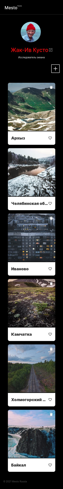

https://github.com/sisyphean0labor-web/to-do-pre
# Яндекс Практикум, проектная работа "Mesto"

## Оглавление

- [Live](#live)
- [Запуск](#запуск)
- [Скриншоты](#скриншоты)
- [Описание](#описание)
- [Автор](#автор)
- [Благодарность](#благодарность)

### Live
https://MikeBeloborodov.github.io/to-do-pre

### Запуск

```
git pull https://github.com/sisyphean0labor-web/to-do-pre.git
cd to-do-pre
npm i
npm run dev
```

### Скриншоты




### Описание

Интерактивная страница, куда можно добавлять фотографии, удалять их и ставить лайки.

Использованные технологии: Webpack.

## Автор

- Github - [sisyphean0labor-web](https://github.com/sisyphean0labor-web)


## Благодарность

Благодарю команду Яндекс Практикум за предоставление дизайна и уроков!
